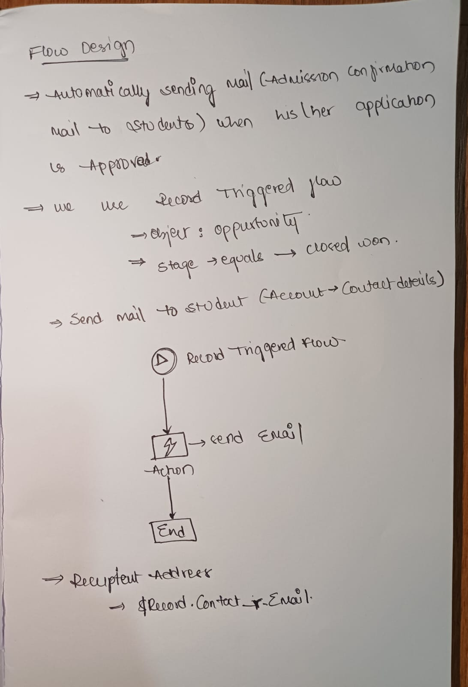

## Day4 - Flow Builder

### 1. What is Flow Builder?

Flow Builder is Salesforce’s visual automation tool that lets administrators and developers create business processes without writing code. It uses a drag-and-drop interface to build flows that collect information, update records, and automate tasks based on user actions or system events.

### 2. Types of Flows

**Screen Flow**
- A Screen Flow is an interactive flow that guides users through a series of screens.
- It can collect input, display information, and make decisions while the user is working in Salesforce.

**Record-Triggered Flow**
- A Record-Triggered Flow runs automatically when a record is created, updated, or deleted.
- It is used to automate actions such as updating related records, sending notifications, or enforcing business rules.

### 3. Your Automation Ideas

1. Automating the admission process by checking the marks percentage .
2. Sending admission confirmation mail to student when his application is approved.
3. warn students when their attendence is below required percentage
4. Automatically  Sending hall tickets to students before exams by checking his/her fee due.
5. Notify the faculty about their upcoming classes. 

### 4. Your Flow Diagram

### 5. Manual vs Automated Process

Manual process:
- A user must open Salesforce, find the correct record, and update fields manually.
- This is slower and can lead to errors or missed steps.

Automated process:
- Flow Builder runs the logic automatically based on record changes or user input.
- This reduces manual work, ensures consistency, and improves accuracy.

